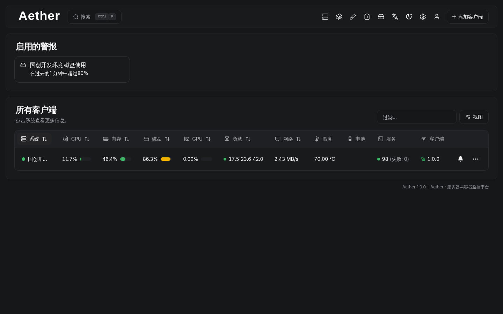
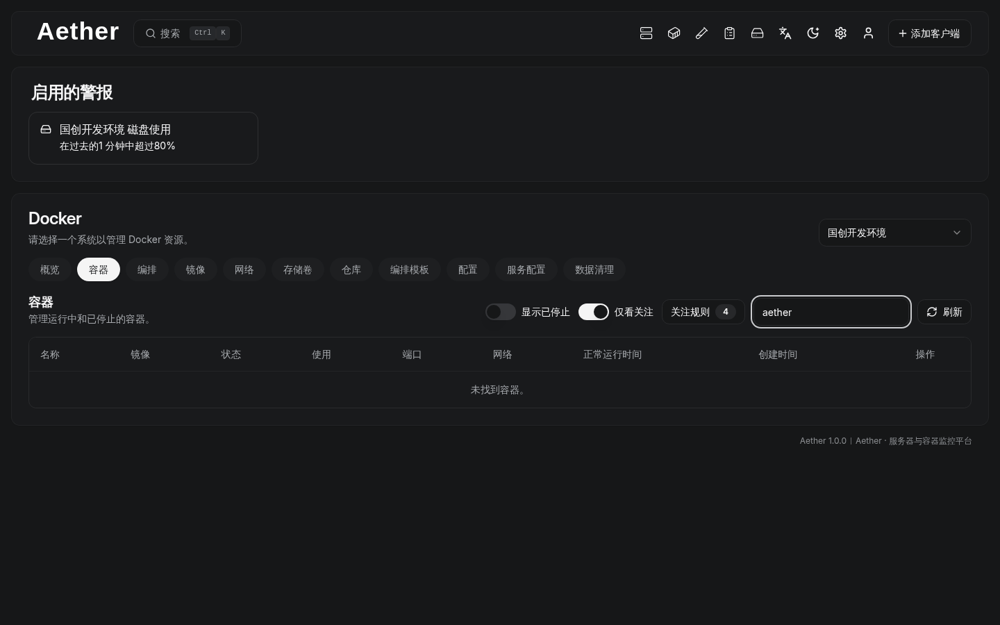
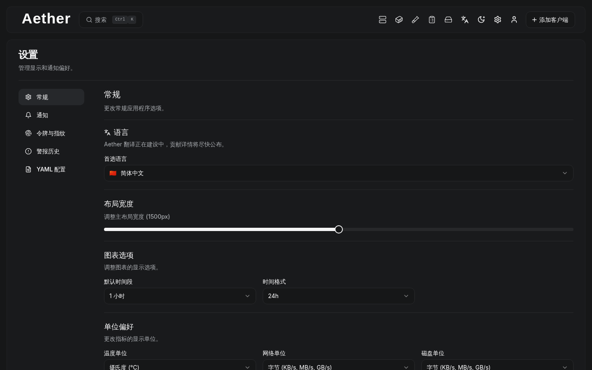
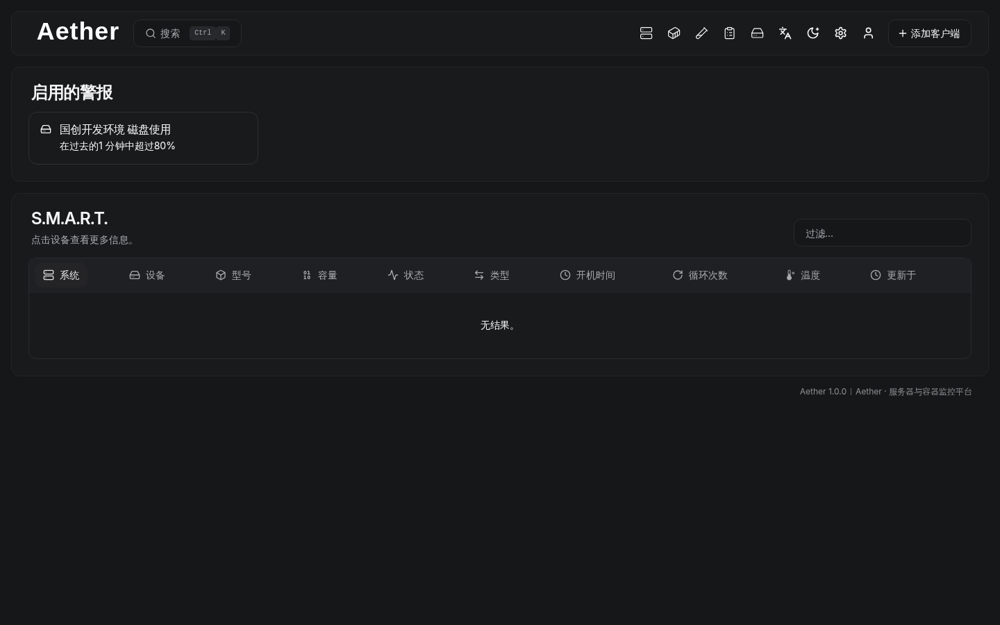

<p align="center">
  
</p>
<h1 align="center">Aether</h1>
<p align="center">自托管的服务器与容器监控 / 运维面板（Hub + Agent）</p>

<p align="center">
  <a href="https://github.com/LuBoyanzy/Aether/releases"></a>
  <a href="https://github.com/LuBoyanzy/Aether/actions/workflows/release.yml"></a>
  <a href="https://github.com/LuBoyanzy/Aether/actions/workflows/docker-images.yml"></a>
  <a href="https://github.com/LuBoyanzy/Aether/blob/main/LICENSE"></a>
</p>

<p align="center">
  <a href="https://github.com/LuBoyanzy/Aether/releases">下载</a> ·
  <a href="#界面预览">界面预览</a> ·
  <a href="#功能亮点">功能亮点</a> ·
  <a href="#快速开始-docker-compose">快速开始</a> ·
  <a href="#安装与升级">安装与升级</a>
</p>

> Aether 面向自托管场景：Hub 提供 Web UI + API + 数据存储；Agent 在被监控机器上采集主机/容器数据，并通过 WebSocket（优先）或 SSH（兜底）与 Hub 交互。

## 界面预览

<p align="center">
  
  
</p>
<p align="center">
  
  
</p>

## 功能亮点

- 主机监控：CPU、内存、磁盘、网络、温度等指标，并提供趋势图表
- Docker / Podman：容器、镜像、网络、存储卷、仓库、Compose 项目与模板的统一管理入口
- 告警与通知：阈值告警、静默时间、邮件（SMTP）与 Webhook（Shoutrrr）通知
- 多用户与权限：支持只读角色；基于 PocketBase 的认证体系，可按需启用 OAuth2/OIDC 与 OTP/MFA
- 运维可观测：审计日志、数据清理任务与执行结果追踪
- 发布与更新：GitHub Releases 提供跨平台二进制；内置 `update` 命令支持自更新

## 架构概览

- Hub（`aether`）：Web UI（内置前端静态资源）+ API + PocketBase 数据库/认证
- Agent（`aether-agent`）：采集系统指标与 Docker/Podman 信息
  - 优先模式：Agent 主动连接 Hub（WebSocket）并响应 Hub 发起的请求（需要 `HUB_URL` + `TOKEN`）
  - 兜底模式：当无法连上 Hub 时，Agent 会启动 SSH 服务，等待 Hub 主动连接（仅需 `KEY`，默认监听 `:45876`）

## 快速开始（Docker Compose）

> 镜像默认发布到 GHCR：`ghcr.io/luboyanzy/*`。如果你需要匿名 `docker pull`，请在 GitHub Packages 将对应 Package 设为 Public；否则需要先 `docker login ghcr.io`。

下面示例用于“同机体验”（Hub 与 Agent 在同一台机器）。如要监控其他机器：Hub 只部署一套；在每台被监控机器上部署 Agent，并把 `HUB_URL` 指向 Hub 的可达地址即可。

```yaml
services:
  aether-hub:
    image: ghcr.io/luboyanzy/aether:1.0.0
    container_name: aether-hub
    restart: unless-stopped
    ports:
      - "19090:19090"
    volumes:
      - ./aether_data:/aether_data

  aether-agent:
    image: ghcr.io/luboyanzy/aether-agent:1.0.0
    container_name: aether-agent
    restart: unless-stopped
    network_mode: host
    volumes:
      - /var/run/docker.sock:/var/run/docker.sock:ro
      - ./aether_agent_data:/var/lib/aether-agent
    environment:
      LISTEN: 45876
      KEY: "ssh-ed25519 ...你的公钥..."
      TOKEN: "你的 token（WebSocket 模式必填；不填会走 SSH 兜底）"
      HUB_URL: "http://localhost:19090"
```

启动后访问：
- `http://localhost:19090`

说明：
- `0.0.0.0` 是监听地址，不是浏览器可访问的目标地址；浏览器请使用 `localhost/127.0.0.1` 或服务器真实 IP。
- Agent 的 `HUB_URL` 必须从 Agent 所在机器可访问到 Hub（例如 `http://<hub所在机器IP>:19090`）。

## 安装与升级

### 方式 1：直接下载 Releases（二进制）

下载入口：`https://github.com/LuBoyanzy/Aether/releases`

Hub（Linux/macOS/Windows）示例：
```bash
aether serve --http=0.0.0.0:19090
```

Windows 示例（在 `cmd.exe` 或 PowerShell 里运行）：
```bash
aether.exe serve --http=0.0.0.0:19090
```

### 方式 2：安装脚本（推荐）

Hub（Linux/macOS/FreeBSD）：
```bash
curl -sL https://raw.githubusercontent.com/LuBoyanzy/Aether/main/supplemental/scripts/install-hub.sh \
  -o install-hub.sh && chmod +x install-hub.sh
./install-hub.sh
```

Agent（Linux/macOS/FreeBSD）：
```bash
curl -sL https://raw.githubusercontent.com/LuBoyanzy/Aether/main/supplemental/scripts/install-agent.sh \
  -o install-agent.sh && chmod +x install-agent.sh
./install-agent.sh -k "ssh-ed25519 ...你的公钥..." -t "<你的token>" -url "http://<hub地址>:19090"
```

Windows Agent：
- `supplemental/scripts/install-agent.ps1`

### 自更新

- Hub：`aether update`
- Agent：`aether-agent update`

## 产物与部署方式

### 1) Docker 镜像（GHCR）

- Hub：`ghcr.io/luboyanzy/aether:<tag>`
- Agent：`ghcr.io/luboyanzy/aether-agent:<tag>`
  - Alpine 变体：`ghcr.io/luboyanzy/aether-agent:alpine`（以及 `:<version>-alpine`）
- Agent（硬件特化）：
  - NVIDIA：`ghcr.io/luboyanzy/aether-agent-nvidia:<tag>`（目前仅 `linux/amd64`）
  - Intel：`ghcr.io/luboyanzy/aether-agent-intel:<tag>`（目前仅 `linux/amd64`）

### 2) GitHub Releases（二进制/安装包）

Releases 会产出（以实际发布页为准）：
- Hub：`aether_<os>_<arch>.tar.gz`（Windows 为 `.zip`）
- Agent：`aether-agent_<os>_<arch>.tar.gz`（Windows 为 `.zip`）
- Linux `deb`：`aether-agent_<version>_linux_<arch>.deb`
- 校验：`aether_<version>_checksums.txt`

## 配置要点

- Hub 端口：默认 `19090`
- Agent 监听端口：默认 `45876`
- 环境变量前缀：
  - Hub 支持 `AETHER_HUB_` 前缀（例如 `AETHER_HUB_APP_URL`）以及无前缀兼容
  - Agent 支持 `AETHER_AGENT_` 前缀（例如 `AETHER_AGENT_KEY`）以及无前缀兼容

## 常见问题

### 1) Windows 双击 `aether.exe` 弹窗 “This is a command line tool”

这是预期行为：请在 `cmd.exe` 或 PowerShell 中运行，例如：
```bash
aether.exe serve --http=0.0.0.0:19090
```

### 2) 我监听了 `0.0.0.0:19090`，浏览器为什么不能访问 `http://0.0.0.0:19090`？

`0.0.0.0` 表示“监听所有网卡”，不是可路由的访问地址。请用：
- 本机：`http://localhost:19090`
- 局域网：`http://<服务器IP>:19090`（并确保防火墙放行该端口）

## 本地开发

1) 启动前端（默认 19091，可改 `PORT`）：
`PORT=19091 make dev-server`

2) 启动 Hub（默认 19090）：
`APP_URL=http://localhost:19090 make dev-hub`

3) 启动 Agent（示例参数请替换）：
`KEY="ssh-ed25519 xxx" TOKEN="xxx" HUB_URL="http://localhost:19090" make dev-agent`

> 若端口冲突，请先释放 19090/19091 或调整上述变量。

## 许可

MIT License，详见本仓库 `LICENSE`。
